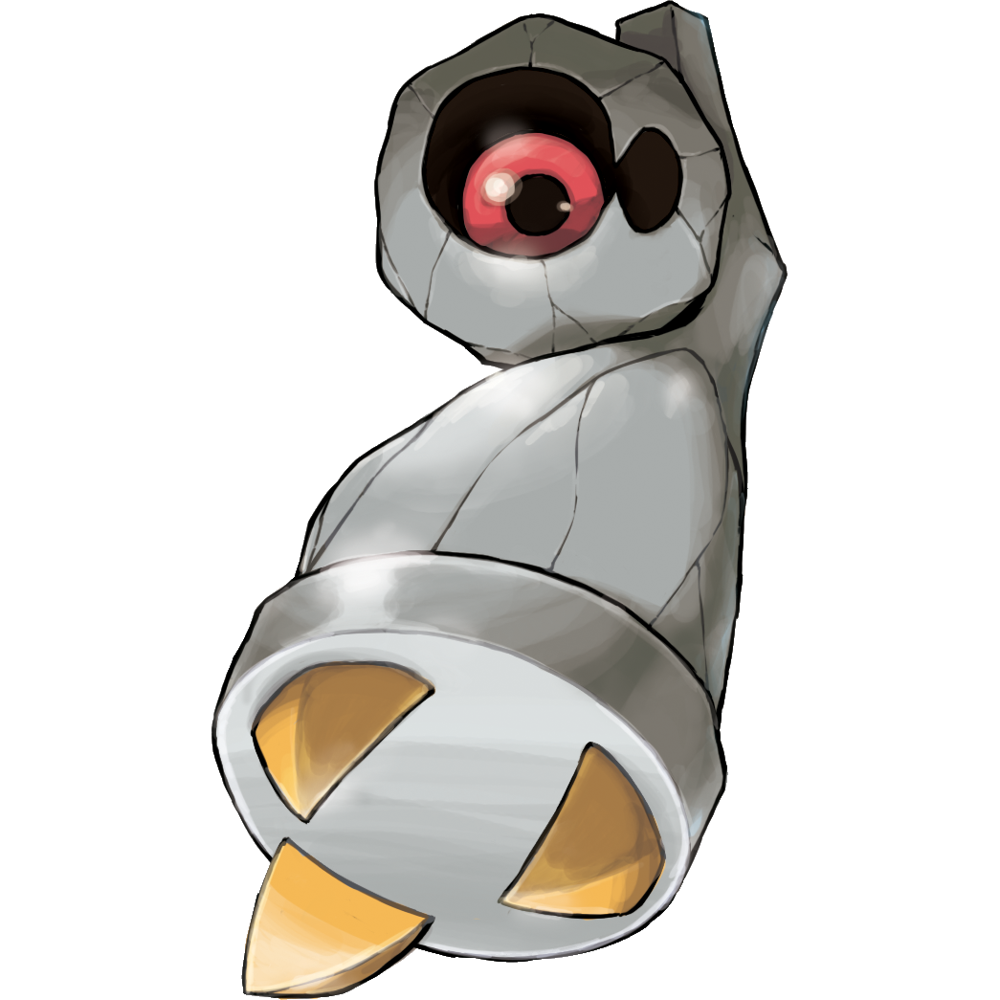
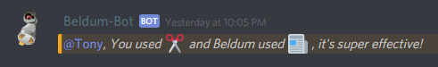
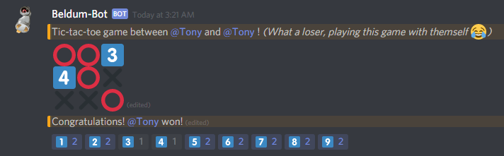

# Beldum-Bot

This is my Discord bot in development.

It is developed in Javascript, utilizing Discordjs, Nodejs, and dotenv.

In case you don't know what a Beldum is... https://bulbapedia.bulbagarden.net/wiki/Beldum_(Pok%C3%A9mon)

It's a Pokemon! One of my favourites.

## Commands
| List of commands (so far): | Description |
| --- | --- |
| //avatar @name | Shows the user's avatar image url. |
| //emoji :custom emoji: | Shows the custom emoji's image url. |
| //google keywords... | Performs a Google search with your keywords. |
| //help | Shows the list of commands with its description. |
| //ping | Shows Beldum-Bot's ping. |
| //rng num1,num2 | Randomly generates a number between num1 and num2. |
| //rps r or p or s | Play rock, paper, scissors with Beldum-bot. |
| //server icon | Shows the server's icon image url. |
| //tictactoe @player1 @player2 | Play tictactoe with another user via reactions. |
| //youtube keywords... | Performs a YouTube search with your keywords. |

## Some examples

